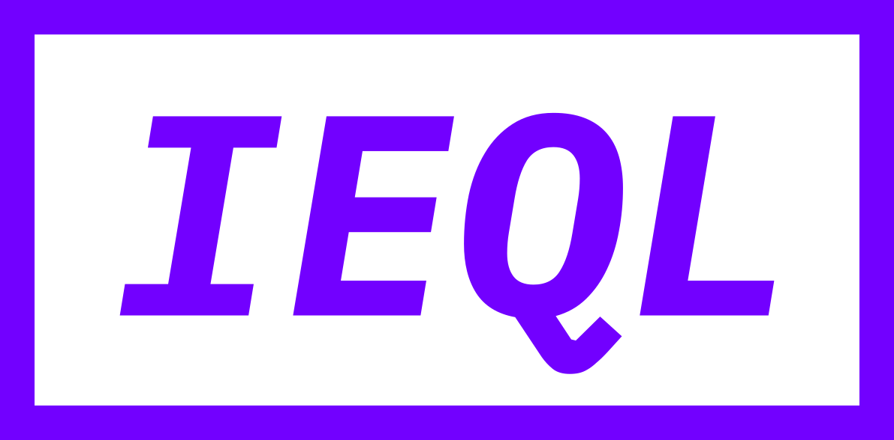

  <h3 align="center"></img></h3>

  

     An open standard for monitoring Internet content.
  

---

This repository contains the specification and reference implementation for IEQL (Internet Extensible Query Language, pronounced _equal_).
